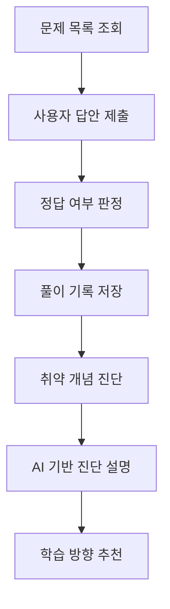

# API Specification

이 문서는 CodeMong의 초기 FastAPI Demo 구조를 기준으로 작성한 API 명세입니다.  
CodeMong은 프로그래밍 초보자의 풀이 기록과 오답 유형을 바탕으로 취약 개념을 진단하고, 생성형 AI가 진단 결과를 설명하는 학습 보조 서비스를 목표로 합니다.

---

## 1. 문제 목록 조회

### Endpoint

```http
GET /problems
```

### Purpose

등록된 프로그래밍 학습 문제 목록을 조회합니다.

### Response Example

```json
[
  {
    "problem_id": 1,
    "concept": "조건문",
    "difficulty": "easy",
    "question": "if문의 기본 구조를 고르시오.",
    "answer": "if condition:"
  },
  {
    "problem_id": 2,
    "concept": "반복문",
    "difficulty": "easy",
    "question": "for문에서 반복 범위를 지정할 때 사용하는 함수는?",
    "answer": "range"
  }
]
```

---

## 2. 답안 제출

### Endpoint

```http
POST /submit
```

### Parameters

| Name | Type | Description |
|---|---|---|
| `user_id` | int | 사용자 ID |
| `problem_id` | int | 문제 ID |
| `answer` | string | 사용자가 제출한 답안 |

### Purpose

사용자가 제출한 답안을 확인하고 정답 여부를 판정합니다.  
이후 풀이 기록은 사용자별 취약 개념 진단의 기초 데이터로 활용됩니다.

### Response Example

```json
{
  "result": "incorrect",
  "submission": {
    "user_id": 1,
    "problem_id": 2,
    "answer": "for",
    "is_correct": false,
    "concept": "반복문"
  }
}
```

---

## 3. 사용자별 취약 개념 진단

### Endpoint

```http
GET /diagnosis/{user_id}
```

### Path Parameter

| Name | Type | Description |
|---|---|---|
| `user_id` | int | 진단 결과를 조회할 사용자 ID |

### Purpose

사용자의 오답 기록을 기준으로 취약 개념을 반환합니다.  
현재 데모에서는 오답이 발생한 개념별 횟수를 집계하는 방식으로 단순화했습니다.

### Response Example

```json
{
  "user_id": 1,
  "weak_concepts": {
    "반복문": 2,
    "조건문": 1
  },
  "ai_role": "Explain diagnosis result and suggest next learning steps"
}
```

---

## 4. 향후 API 확장 계획

| Feature | Endpoint | Description |
|---|---|---|
| 문제 등록 | `POST /problems` | 문제은행에 문제 추가 |
| 오답 유형 저장 | `POST /mistakes` | 문법 실수, 개념 부족, 로직 오류 등 오답 유형 기록 |
| 취약도 점수 조회 | `GET /diagnosis/{user_id}/score` | 정답 여부, 풀이 시간, 시도 횟수, 오답 유형 기반 취약도 점수 조회 |
| AI 진단 설명 | `POST /ai-feedback` | 진단 결과를 사용자가 이해하기 쉬운 자연어로 설명 |
| 학습 추천 조회 | `GET /recommendations/{user_id}` | 취약 개념에 따른 다음 학습 방향 추천 |

---

## 5. API Flow



---

## 6. Design Note

현재 API는 완성형 서비스가 아니라 CodeMong의 핵심 흐름을 검증하기 위한 초기 데모입니다.

초기 목표는 다음 세 가지입니다.

1. 사용자가 문제를 조회할 수 있는지 확인
2. 답안 제출 후 정답 여부를 판정할 수 있는지 확인
3. 누적된 오답 기록을 기준으로 취약 개념을 반환할 수 있는지 확인

향후에는 실제 DB 연동, 오답 유형 저장, 취약도 점수 계산, 생성형 AI 기반 설명 기능을 순차적으로 확장할 계획입니다.
